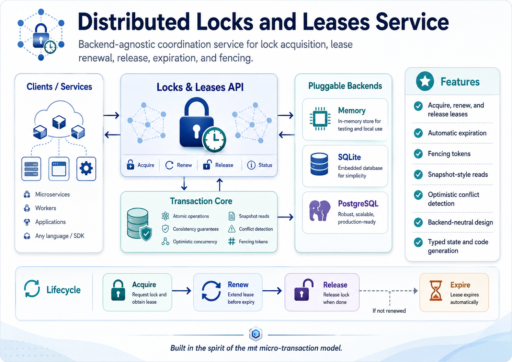

# dl

`dl` is a C++20 distributed locks and leases library built on the sibling `mt` library.

It is intended to provide the foundational coordination primitive for higher-level
systems such as queues, schedulers, workflow engines, control planes, and service
registries. The core idea is simple: represent exclusive ownership as a durable lease
row, then use `mt` transactions, absent-key reads, point-read validation, and optimistic
concurrency control to make acquire, renew, release, and expiry conflict-detected.

## Short Description

C++20 `mt`-backed distributed locks and leases with compare-and-swap-style acquire,
renew, release, and expiry semantics.

## Why This Exists

Locks and leases are the primitive coordination unit for a distributed systems stack.
They show up inside:

- queue message claims
- job ownership and heartbeats
- workflow step leases
- leader election
- singleton control-plane reconcilers
- service registration and health tracking
- exclusive access to named resources

`dl` should make that pattern reusable instead of reimplementing narrow lease logic in
each higher-level project.

## Intended Model

A lock is a named resource with a current holder and an expiry time.

```text
resource_key -> holder_id, fencing_token, expires_at
```

The first implementation should support:

- acquire when no unexpired lease exists
- acquire after expiry
- renew by the current holder only
- release by the current holder only
- inspect the current lease
- reject conflicting acquire or renew attempts
- monotonically increasing fencing tokens

The safety property comes from `mt`:

- acquire uses an absent-key or point read before writing ownership
- renew uses a point read of the current lease version
- release uses a point read of the current lease version
- concurrent conflicting decisions fail at commit or observe the newer state on retry

## Initial API Sketch

```cpp
dl::LeaseClient leases{database};

auto acquired = leases.try_acquire(
    dl::AcquireLeaseRequest{
        .resource_key = "queue:orders:consumer",
        .holder_id = "worker-1",
        .ttl_ms = 30000,
        .now_ms = now_ms
    }
);

if (acquired)
{
    leases.renew(
        dl::RenewLeaseRequest{
            .resource_key = acquired->resource_key,
            .holder_id = acquired->holder_id,
            .fencing_token = acquired->fencing_token,
            .ttl_ms = 30000,
            .now_ms = later_ms
        }
    );
}
```

The exact API can evolve, but v1 should keep the library backend-neutral by accepting an
`mt::Database&` and using private `mt_codegen.py` table mappings internally.

## Relationship To `qu`

`qu` can use `dl` as the reusable lease primitive for message claims:

- a pending message is claimed by acquiring a lease for `message:<id>`
- the visibility timeout is the lease TTL
- a worker can renew the claim by renewing the lease
- expired leases make messages claimable again
- fencing tokens can prevent stale workers from acknowledging old claims

The first `qu` implementation may keep local claim fields, but `dl` should define the
shared semantics that queue, scheduler, and workflow repos converge on.

## Build Direction

This repository starts with documentation only. The intended first scaffold should mirror
the other `mt`-based repos:

- C++20 library under `include/dl/` and `src/`
- private `mt` schemas under `src/tables/schemas/`
- generated mappings under `src/tables/generated/`
- memory-backed tests using `mt::backends::memory::MemoryBackend`
- `Makefile` targets for build, test, codegen, codegen-check, format, and clean

## Non-Goals For V1

- no external lock service
- no network server
- no clock synchronization protocol
- no blocking wait API
- no fairness guarantee
- no durable backend choice beyond what `mt` provides

## Roadmap

- implement lease row schema and generated mapping
- implement `LeaseClient`
- add acquire, renew, release, get, and expire behavior
- add fencing tokens
- add memory backend tests for races and expiry
- add examples showing `qu` message claim integration
